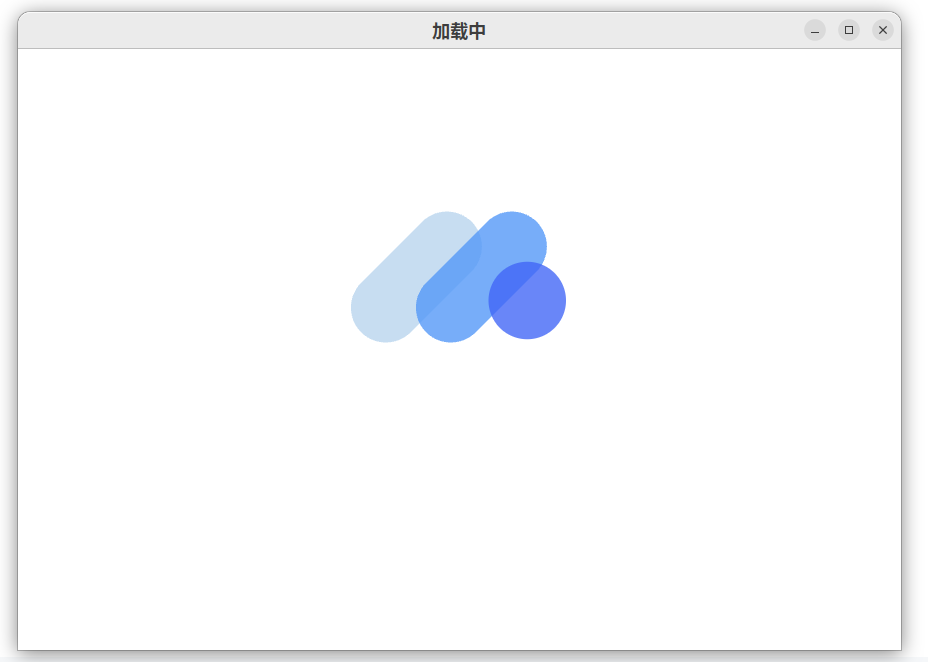
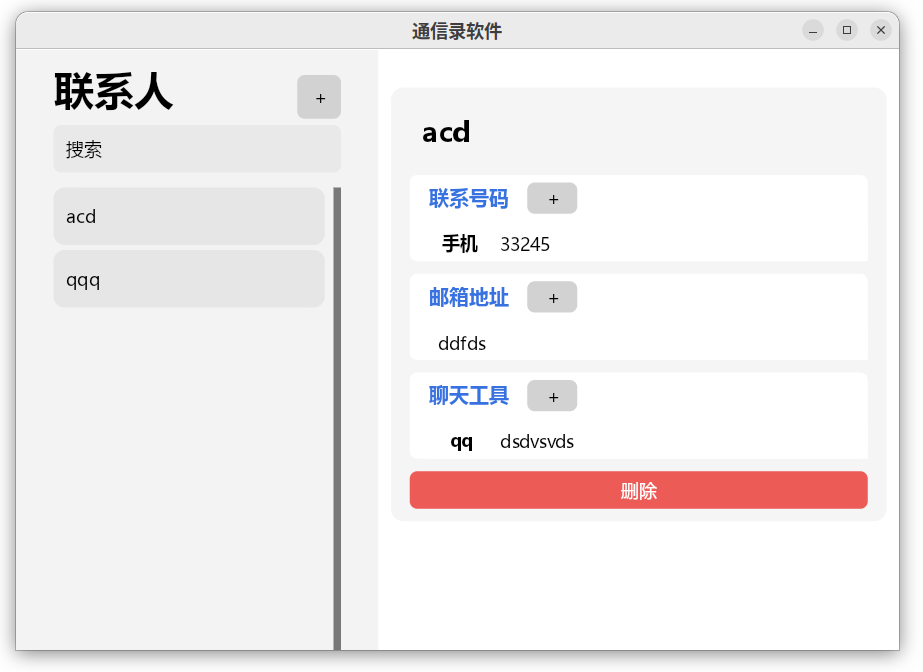
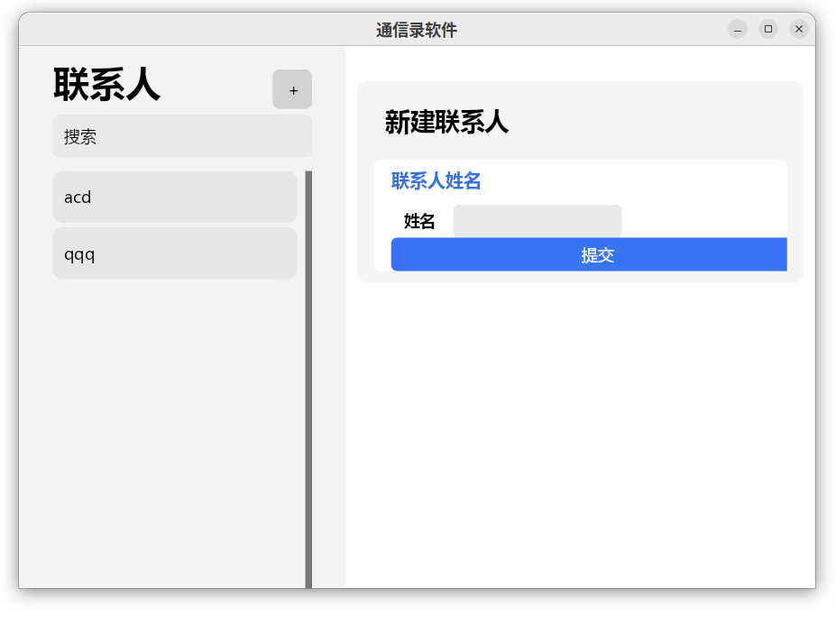

# Contacts Manager

Java高级程序设计 课程设计项目  
湖南理工学院 信息科学与工程学院 计算机科学与技术 2020级  

选题: 通信录软件  
同组成员：[@tdiant](https://github.com/tdiant) [@Recopec](https://github.com/recopec)

## 简介

本软件是Java高级程序设计课程的课程设计作业。  

本软件基于Java平台，开发一款以图形界面作为载体，数据存储以数据库交互式操作为核心的通信录软件。  
本软件以针对Java平台的高级用法进行进一步探索为主，对各个部分的功能做更加具体细致的分析，以此来在具体落实应用的前提下逐步探索深层次的运行机理。

本软件所开发的通讯录软件相对传统的通讯录软件，其核心特点如下：  

1. **使用自行开发的图形界面库**。本软件基于Skija库，通过链接LWJGL和GLFW，开发了一套简易的图形界面库；  
2. **自行开发的事件系统**。本软件自行开发了一套基于注解声明的简易事件系统；  
3. **使用sqlite作为数据库**；  
4. **多模块的开发部署架构**。本软件使用Maven作为项目依赖管理，将项目分为多个模块进行开发。  

## 第三方库

* [HumbleUI/Skija](https://github.com/HumbleUI/Skija)
* [LWJGL](https://www.lwjgl.org/)
* [sqlite-jdbc](https://github.com/xerial/sqlite-jdbc)

## 界面截图

